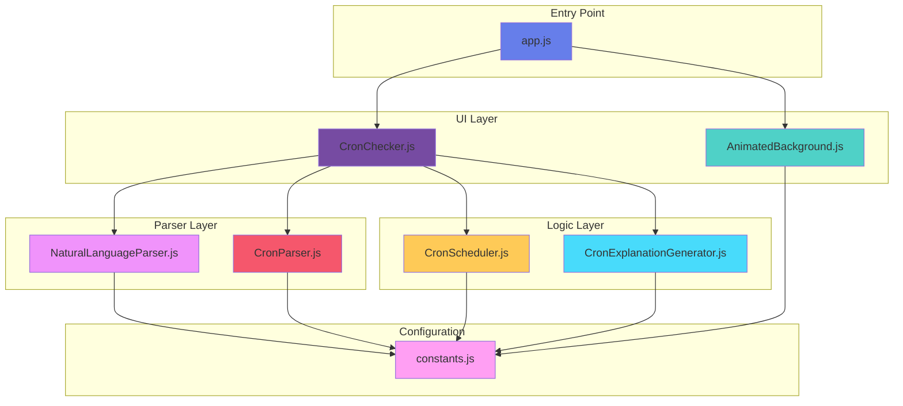
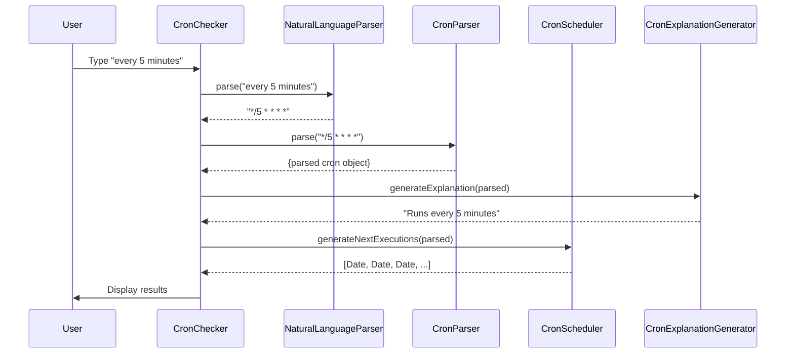

<div align="center">

# ⏰ CronFlow

**Master your cron expressions with natural language and real-time feedback**

[](LICENSE)
[](https://developer.mozilla.org/en-US/docs/Web/JavaScript)
[](https://developer.mozilla.org/en-US/docs/Web/JavaScript/Guide/Modules)

[Demo](#-quick-start) • [Features](#-features) • [Architecture](#-architecture) • [Installation](#-installation) • [Documentation](#-documentation)

---

</div>

## 🌟 Features

- **🗣️ Natural Language Input**: Convert phrases like "every Monday at 3pm" or "quarterly" into cron expressions
- **✅ Real-time Validation**: Instant feedback on cron expression validity
- **📖 Human-Readable Explanations**: See what your cron expression means in plain English
- **⏭️ Next Execution Times**: View the next 5 scheduled runs with relative time
- **🔍 Field Breakdown**: Understand each component (minute, hour, day, month, weekday)
- **✨ Interactive Background**: Subtle particle animation that responds to cursor movement
- **📋 Copy to Clipboard**: One-click copy of generated cron expressions
- **🎨 Modern UI**: Clean, responsive design with smooth animations

- **🎨 Modern UI**: Clean, responsive design with smooth animations

## 🚀 Quick Start

### Prerequisites

- A modern web browser (Chrome 61+, Firefox 60+, Safari 11+, or Edge 16+)
- Python 3, Node.js, or PHP (for local server)

### Installation

1. **Clone the repository**
   ```bash
   git clone https://github.com/yourusername/cronflow.git
   cd cronflow
   ```

2. **Start a local server**
   
   Choose one of the following methods:
   
   **Python:**
   ```bash
   python3 -m http.server 8080
   ```
   
   **Node.js:**
   ```bash
   npx http-server -p 8080
   ```
   
   **PHP:**
   ```bash
   php -S localhost:8080
   ```

3. **Open in browser**
   
   Navigate to [http://localhost:8080](http://localhost:8080)

> **Note:** A web server is required because the application uses ES6 modules, which need HTTP protocol (not `file://`).

## 📸 Screenshots

### Natural Language Mode
Type in plain English and see the cron expression generated instantly:
- "every 5 minutes" → `*/5 * * * *`
- "weekdays at 9am" → `0 9 * * 1-5`
- "quarterly at 3pm" → `0 15 1 1,4,7,10 *`

### Cron Expression Mode
Enter standard cron expressions and get human-readable explanations with execution schedules.

## 🏗️ Architecture

CronFlow follows a modular architecture with clear separation of concerns:



### Module Responsibilities

| Module | Purpose | Lines |
|--------|---------|-------|
| **app.js** | Application entry point and initialization | 17 |
| **constants.js** | Centralized configuration and constants | 95 |
| **AnimatedBackground.js** | Canvas particle animation system | 228 |
| **NaturalLanguageParser.js** | Natural language to cron conversion | 435 |
| **CronParser.js** | Cron expression parsing and validation | 271 |
| **CronScheduler.js** | Execution time calculations | 141 |
| **CronExplanationGenerator.js** | Human-readable descriptions | 155 |
| **CronChecker.js** | Main UI orchestration and event handling | 397 |

### Component Interaction Flow



## 📁 Project Structure

```
cronflow/
├── index.html                          # Main HTML file
├── styles.css                          # Complete styling and animations
├── js/                                 # Modular JavaScript files
│   ├── app.js                         # Application entry point
│   ├── constants.js                   # Configuration and constants
│   ├── AnimatedBackground.js          # Particle animation system
│   ├── NaturalLanguageParser.js       # Natural language to cron converter
│   ├── CronParser.js                  # Cron expression parser/validator
│   ├── CronScheduler.js               # Execution time calculator
│   ├── CronExplanationGenerator.js    # Human-readable descriptions
│   └── CronChecker.js                 # Main application orchestrator
├── README.md                          # Project documentation
├── QUICK_START.md                     # Quick start guide
└── REFACTORING_SUMMARY.md             # Refactoring documentation
```

## 📚 Documentation

### Natural Language Patterns

CronFlow supports a wide variety of natural language patterns:

#### Time-Based
- `every N minutes/hours` → `*/N * * * *` or `0 */N * * *`
- `every minute/hour/day` → `* * * * *`, `0 * * * *`, `0 0 * * *`

#### Daily Schedules
- `daily at 3pm` → `0 15 * * *`
- `every day at 9:30am` → `30 9 * * *`

#### Weekly Schedules
- `every Monday` → `0 9 * * 1`
- `weekdays` → `0 9 * * 1-5`
- `weekends` → `0 10 * * 0,6`
- `Monday and Friday` → `0 9 * * 1,5`
- `every Monday and Wednesday at 2:30pm` → `30 14 * * 1,3`

#### Monthly Schedules
- `once a month` → `0 0 1 * *`
- `15th of each month` → `0 0 15 * *`
- `last day of month` → `0 0 L * *` (approximated)
- `first Monday of month` → `0 0 1-7 * 1`

#### Yearly Schedules
- `once a year` → `0 0 1 1 *`
- `quarterly` → `0 0 1 1,4,7,10 *`
- `every January 1st` → `0 0 1 1 *`
- `New Year's Day` → `0 0 1 1 *`

### Cron Expression Format

Standard 5-field cron format:
```
* * * * *
│ │ │ │ │
│ │ │ │ └─── Weekday (0-7, 0 and 7 = Sunday)
│ │ │ └───── Month (1-12)
│ │ └─────── Day of Month (1-31)
│ └───────── Hour (0-23)
└─────────── Minute (0-59)
```

#### Special Characters
- `*` - Any value
- `,` - List (e.g., `1,3,5`)
- `-` - Range (e.g., `1-5`)
- `/` - Step (e.g., `*/5` or `1-10/2`)

### API Reference

#### CronParser

```javascript
import { CronParser } from './js/CronParser.js';

// Parse a cron expression
const parsed = CronParser.parse('*/5 * * * *');
// Returns: { minute: {...}, hour: {...}, day: {...}, month: {...}, weekday: {...} }
```

#### NaturalLanguageParser

```javascript
import { NaturalLanguageParser } from './js/NaturalLanguageParser.js';

const parser = new NaturalLanguageParser();
const cron = parser.parse('every 5 minutes');
// Returns: '*/5 * * * *'
```

#### CronScheduler

```javascript
import { CronScheduler } from './js/CronScheduler.js';

const executions = CronScheduler.generateNextExecutions(parsed);
// Returns: [Date, Date, Date, Date, Date]
```

## 🛠️ Development

### Code Quality

The codebase follows modern JavaScript best practices:

- ✅ **ES6+ Features**: Classes, modules, arrow functions, template literals
- ✅ **Modular Architecture**: Single responsibility principle
- ✅ **JSDoc Documentation**: Comprehensive inline documentation
- ✅ **DRY Principle**: No code duplication
- ✅ **Descriptive Naming**: Self-documenting code
- ✅ **Error Handling**: Centralized error messages
- ✅ **Constants Extraction**: No magic numbers

### Testing

You can test individual modules in the browser console:

```javascript
// Test natural language parsing
import { NaturalLanguageParser } from './js/NaturalLanguageParser.js';
const parser = new NaturalLanguageParser();
console.log(parser.parse('every Monday at 3pm')); // "0 15 * * 1"

// Test cron parsing
import { CronParser } from './js/CronParser.js';
console.log(CronParser.parse('0 9 * * 1-5'));
```

### Adding New Features

1. Create a new module in `/js` folder
2. Import required dependencies
3. Export your class or functions
4. Import in the relevant module
5. Update documentation

## 🤝 Contributing

Contributions are welcome! Please feel free to submit a Pull Request. For major changes:

1. Fork the repository
2. Create your feature branch (`git checkout -b feature/AmazingFeature`)
3. Commit your changes (`git commit -m 'Add some AmazingFeature'`)
4. Push to the branch (`git push origin feature/AmazingFeature`)
5. Open a Pull Request

## 📝 Examples

### Common Cron Patterns

| Description | Natural Language | Cron Expression |
|-------------|------------------|-----------------|
| Every 5 minutes | `every 5 minutes` | `*/5 * * * *` |
| Every hour | `every hour` | `0 * * * *` |
| Daily at midnight | `daily at midnight` | `0 0 * * *` |
| Weekdays at 9am | `weekdays at 9am` | `0 9 * * 1-5` |
| Every Monday | `every Monday` | `0 9 * * 1` |
| First of month | `once a month` | `0 0 1 * *` |
| Quarterly | `quarterly` | `0 0 1 1,4,7,10 *` |
| Yearly | `once a year` | `0 0 1 1 *` |

## 🐛 Troubleshooting

### Module Loading Errors

**Problem:** `Failed to load module` or CORS errors  
**Solution:** Ensure you're using a web server (http://), not opening files directly (file://)

### Blank Page

**Problem:** Page loads but shows nothing  
**Solution:** Check browser console for errors. Verify all files are in correct locations.

### Element Not Found Errors

**Problem:** `Cannot read properties of null`  
**Solution:** Verify HTML element IDs match JavaScript selectors in CronChecker.js

## 🌐 Browser Support

| Browser | Minimum Version |
|---------|----------------|
| Chrome | 61+ |
| Firefox | 60+ |
| Safari | 11+ |
| Edge | 16+ |

ES6 modules and modern JavaScript features are required.

## 📄 License

This project is licensed under the MIT License - see the [LICENSE](LICENSE) file for details.

## 🙏 Acknowledgments

- Built with vanilla JavaScript (no frameworks!)
- Animated background powered by Canvas API
- Icons from [Font Awesome](https://fontawesome.com/)
- Fonts from [Google Fonts](https://fonts.google.com/) (Inter, Orbitron)
- Created as a GitHub Copilot training project

## 📧 Contact

For questions or feedback, please open an issue on GitHub.

---

<div align="center">

**Made with ❤️ and GitHub Copilot**

⭐ Star this repo if you find it helpful!

</div>
